# BACKEND - Vigil Summit — Autonomous B2B Funnel Agent

Sistema multi-agente para captação, engajamento e follow-up automatizado de leads do **Vigil Summit**, evento anual da Vigil.AI para CISOs, CTOs e gestores de risco.



## Visão Geral

O sistema orquestra três agentes de IA para gerenciar o ciclo de vida completo de um lead: desde a inscrição no evento até o follow-up pós-evento, com comunicação personalizada por cargo, setor e canal.

**Funil em três fases:**

| Fase | O que acontece |
|------|----------------|
| **Captação** | Lead se inscreve via webhook → dados salvos → enriquecimento com web scraping simulado |
| **Engajamento** | Planner cria estratégia ICP → Writer gera mensagens personalizadas → rotinas agendadas disparam pré-evento |
| **Follow-up** | Após o evento, Followup Agent cria sequência customizada baseada no contexto de participação |

---

## Princípios de Design e Negócio

O objetivo central do sistema é converter inscritos em participantes confirmados e, após o evento, em reuniões comerciais — controlando no-show e maximizando engajamento em cada etapa do funil.

- **Agentes verticalizados** — cada agente tem uma responsabilidade única e bem definida (estratégia, escrita, follow-up), garantindo maior precisão e qualidade em cada etapa do funil.
- **Balanceamento de dados externos** — enriquecimento combina perfis internos por cargo com dados dinâmicos de scraping, produzindo personalização real e não comunicação genérica.
- **Rotinas diversificadas por ICP** — leads são segmentados por tier (A/B/C), canal e timing antes de qualquer disparo, aumentando a chance de resposta e reduzindo no-show.
- **Análise ponta a ponta** — o sistema cobre pré-evento, durante e pós-evento, permitindo entender o nível de interesse do participante em cada fase e direcionar a abordagem para uma reunião comercial.

---

## Stack Tecnológico

| Componente | Escolha | Justificativa |
|-----------|---------|---------------|
| LLM principal | Claude Sonnet | Equilíbrio entre velocidade e capacidade de raciocínio para o Planner |
| LLM fallback/operacional | Claude Haiku | Custo-benefício para Writer e tarefas operacionais |
| Framework de agentes | Agno | Controle preciso de tools, direcionamento de dados e definição de comportamentos |
| Banco de dados | SQLite (dev) / PostgreSQL (prod) | Estruturado com suporte a JSON dinâmico para dados de enriquecimento |
| API | FastAPI + Uvicorn | Performance assíncrona, background tasks nativas |
| Scheduler | APScheduler | Agendamento das réguas de comunicação em relação à data do evento |
| E-mail | MailerSend | Canal padrão de comunicação |
| WhatsApp | Twilio | Canal de alta intimidade para leads Tier A |
| Deploy | Render | Server as a Service, baixo tempo de operação |

---

## Arquitetura de Agentes

### Planner Agent (`agents/planner_agent.py`)
- **Modelo:** Claude Sonnet (fallback: Haiku)
- **Função:** Recebe dados do lead anonimizados e produz um plano JSON acionável com estratégia ICP/MEDDICC, canal recomendado, tiering e instruções para o Writer.
- **Output:** JSON estruturado com `analyse`, `engajamento-1`, `check-in`, `late-checkin`.

### Writer Agent (`agents/writer_agent.py`)
- **Modelo:** Claude Sonnet (fallback: Haiku)
- **Função:** Gera o conteúdo final das mensagens (e-mail HTML ou WhatsApp texto plano) a partir das instruções do Planner.
- **Dispatch:** Se `MAILERSEND_API_KEY` estiver configurada, envia via MailerSend. Sem a chave, imprime preview em modo mock.

### Followup Agent (`agents/followup_agent.py`)
- **Função:** Cria sequência de follow-up pós-evento customizada com base no contexto de participação do lead (sessões assistidas, interesses demonstrados).

### Anonymizer (`agents/anonymizer.py`)
- Anonimiza PII antes de enviar ao LLM (nome, e-mail, empresa).
- Deanonimiza o output antes do dispatch para garantir conformidade com LGPD.

---

## Enriquecimento de Dados (Web Scraping Simulado)

A função `search_professional_data` em `tools.py` simula um pipeline de web scraping. Em produção, deve ser substituída por integrações reais.

**Duas fontes:**

- **Manual (`MANUAL_DATA.json`):** Perfis por cargo (CISO, CTO, SOC Analyst etc.) com ICP score, pain points, tecnologias típicas e abordagem de mensagem.
- **Dinâmico (`WEB_SCRAPING.json`):** Dados simulados de LinkedIn, notícias e posts por cargo.

**Detecção de cargo:** feita por matching de keywords no e-mail + título (`_ROLE_KEYWORDS` em `tools.py`).

**ICP Tiering:**
- `score >= 80` → Tier A: WhatsApp + toque consultivo
- `50–79` → Tier B: e-mail com prova de valor
- `< 50` → Tier C: abordagem educacional

Para conectar a fontes reais, substitua o corpo de `search_professional_data` mantendo o mesmo schema de retorno JSON.

---

## Réguas de Comunicação

### Pré-evento

| Rotina | Timing | Status do lead alvo |
|--------|--------|---------------------|
| `engagement` | 3 dias antes | `confirmed` |
| `no_confirmation` | 1 dia antes | `enriched` (não confirmados) |
| `engagement_confirmed` | 2 horas antes | `no_confirmation_confirmed` |

**Janelas de envio disponíveis:** 09h, 14h, 20h (BRT)

### Pós-evento

Sequência customizada pelo Followup Agent. A quantidade, frequência e conteúdo das mensagens são definidos com base no enriquecimento do lead e no contexto do evento (sessões assistidas, booth visitado, perguntas feitas).

O scheduler é configurado automaticamente no startup da API quando `EVENT_DATE` está definida (`internal/routine.py` → `setup_event_routines`).

---

## Conformidade LGPD

- **Opt-in explícito** no formulário de captação como pré-requisito para uso dos dados.
- **TTL de dados:** campo `expires_at` em cada lead. Job `lgpd_purge_expired_leads` roda a cada 24h e remove registros expirados. Configurável via `LEAD_TTL_DAYS` (padrão: 180 dias).
- **Anonimização antes do LLM:** PII (nome, e-mail, empresa) é substituída por placeholders antes de chegar ao modelo e restaurada no output.
- **Anthropic API:** dados enviados via API não são usados para treinamento de modelos.

---

## Setup

### Variáveis de Ambiente

```env
ANTHROPIC_API_KEY=
EVENT_DATE=2025-03-15T09:00:00           # ISO 8601, dispara setup das rotinas
JWT_SECRET=
AUTH_EMAIL=
AUTH_PASSWORD=
MAILERSEND_API_KEY=                       # opcional; sem ela, e-mails são mockados
WHATSAPP_DEFAULT_NUMBER=+5511000000000    # fallback se lead não tiver phone
LEAD_TTL_DAYS=180                         # opcional
EVENT_EMAIL_SUBJECT=Vigil Summit          # opcional
```

### Instalação

```bash
pip install -r requirements.txt
```

### Executar a API

```bash
uvicorn api:app --reload
```

### Executar demo local (sem API)

```bash
python main.py
```

Processa os dois leads mock definidos em `MOCK_LEADS` e imprime o relatório de tokens/custo ao final.

---

## API

### Autenticação

`POST /auth/login` — retorna JWT válido por 24h. Endpoints de dashboard (`/funil-approchs`) exigem `Authorization: Bearer <token>`.

### Endpoints

| Método | Rota | Descrição |
|--------|------|-----------|
| `POST` | `/subscribe` | Inscreve lead + dispara Planner em background |
| `POST` | `/subscribe/single-workflow` | Inscreve lead + executa workflow completo (Planner + Writer + Followup) |
| `POST` | `/event/lead` | Adiciona evento de contexto a um lead (ex.: sessão assistida) |
| `PATCH` | `/leads/{lead_id}/confirm` | Confirma presença (`?late=true` para confirmação tardia) |
| `POST` | `/funil-approchs` | Cria abordagem manual no funil (requer auth) |
| `GET` | `/funil-approchs/{user_id}` | Lista abordagens de um lead (requer auth) |

**Payload de inscrição:**

```json
{
  "name": "Ricardo Mendes",
  "email": "ricardo@empresa.com.br",
  "company": "TechShield Solutions",
  "title": "Chief Technology Officer",
  "channel": "whatsapp",
  "additional_data": { "phone": "+5511999990001" }
}
```

**Status do funil:** `captured` → `enriched` → `confirmed` / `late_confirmed` → `meeting_scheduled`

---

## Estrutura do Projeto

```
.
├── api.py                        # FastAPI app, endpoints, lifespan
├── main.py                       # Demo CLI com leads mock
├── database.py                   # SQLite: leads, agent_usage, funil_approchs
├── tools.py                      # search_professional_data (scraping simulado)
├── MANUAL_DATA.json              # Perfis internos por cargo
├── WEB_SCRAPING.json             # Dados simulados de scraping por cargo
├── agents/
│   ├── planner_agent.py          # Vigil Sales Strategist Agent
│   ├── writer_agent.py           # Vigil Communication Writer Agent
│   ├── followup_agent.py         # Post-event Followup Agent
│   ├── single_workflow.py        # Pipeline síncrono: plan → write → followup
│   ├── anonymizer.py             # PII anonymizer/deanonymizer
│   ├── claude.py                 # Factory de modelos Anthropic
│   └── event_context.py         # Loader do EVENT-DETAILS.md para system prompt
├── internal/
│   ├── routine.py                # APScheduler setup + setup_event_routines
│   └── routines_workflows.py    # Rotinas de batch (engagement, confirmation etc.)
├── external/
│   ├── mailersender.py           # MailerSend integration
│   └── whatsapp.py               # Twilio WhatsApp integration
└── services/
    ├── lead_service.py
    └── funil_approch_service.py
```

---

## Rastreabilidade

Toda chamada de agente é registrada na tabela `agent_usage` com: tokens de input/output, custo estimado, duração e fase do funil. Acessível via `database.list_usage()` ou no relatório final do `main.py`.

---

## Escala

Para replicar o modelo a múltiplos eventos simultâneos sem reescrever os agentes:

- **Dynamic Prompts:** ajustar `EVENT-DETAILS.md` por evento antes da execução dos workflows, mantendo a mesma arquitetura de agentes.
- **Prompt Caching + Batch Processing** da Anthropic para redução de custo em alto volume.
- **PostgreSQL** com réplicas de leitura, separação read/write e pool de conexões.
- **Processamento paralelo** de workloads por evento via workers independentes.
- **Infraestrutura distribuída** (AWS/GCP) com filas para os jobs de scheduler.